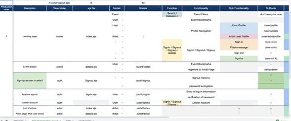
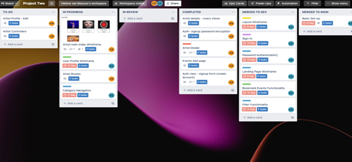

## **Project 2 - Music Events App**
___

### **Contents**
---
* Overview
* The Brief & Timeframe 
* Technologies used 
* App Flow 
* The Planning & Development Process 
* Wins & Challenges
* Bugs
* Future Enhancements 
* Key Learnings
 

### **Overview**
---

The Music Events App is a site that allows Artists to create and promote their events and users can filter through these events and bookmark to the profile the ones they wish to attend.

The source code can be found on GitHub [here](https://github.com/HelenevB/Project-2-SEI66-musicevents)

**Code Access and Installation**

* Clone the repository,
* run npm install to download all the required dependencies,
* set up a .env file: 

    * configure to a Port (line 15 server.js file) 
    * configure to your local mongo dB database (line 68 server.js file)
    * configure your secret (line 42 server.js file) 
    * run the npm test to then start the application 

**Deployment**

The deployed app can be found [here](https://sei66musiceventsapp.herokuapp.com/auth/signin). 

To explore the features available to the artist, please use the following log-in credentials:

**email**: toots@email.com 
**password**: toots  

To explore the features available to general users, please use the following log-in credentials: 

**email**: demo@email.com 
**password**: demo 

Please note there is an issue with image upload where Heroku’s file storage deletes any newly uploaded images after less than 24 hours. Any newly uploaded images will not render correctly after a 24-hour period. 
 

### **The Brief & Timeframe**
---

*	To build a web application using express framework 
*	To be deployed on Heroku 
*	As part of the planning process, an Entity Relationship Diagram and Wireframe were required 
*	Functionality requirements: 
     *	a user must have a profile 
	 *   a user must be able to edit their profile and change their password
	* a user must be able to sign in and sign-out 
	* a user must be able to create and then be able to edit, review, and delete this resource 
* This was a group project alongside [Ellie Eadington](https://github.com/ellieeadington) 
* Timeframe: 7 Days 
 

### **Technologies Used**
---
* Express
* Node.js
* Nodemon
* HTML
* CSS
* JavaScript
* MongoDB/Mongoose
* Git & GitHub 
 

### **App Flow**
---
The **main index** page (homepage)

From there, the user can **sign** up or **log in**. 

Once logged in, all users will be redirected back to the above homepage.  ‘general-users’ will be able to bookmark events to their profile by clicking “add”. From their profile, they can remove the event and also view/ update their account details:

**Event details page**: 

General users can also **view all Artists** registered with the site and the details for each **Artist**.

**Artists account profile**: if the user is registered as an artist, their account profile will give them access to creating, updating and deleting events they are associated with: 

 

### **Planning & Development Process**
---
For this project, we thought it would be nice to build the application around a subject that we could both get stuck into, so ahead of landing on any ideas, we talked about what our interests were; we established through this that we both had a passion for music and enjoyed going to gigs, so agreed a music events app would be the way forward. 

We started the planning process by establishing our models and the relationships between each of these using an ERD:

We agreed that there would be three schemas: 

1. User 
2. Artist 
3. Events 

 We determined that the artist and the general user would have many-to-many relationships with events. 

The nature of our app meant that we had identified two types of users: the general user and the artist. 

Therefore, the Artist schema was to reference the user associated, so it should have had a one-to-one reference relationship with the Artist model; however, at the time this was coded as a one-many.

Once we had finalised our ERD, we worked on drawing up our wireframe (using Figma) and created a roadmap of requirements for the site to establish what features we would focus on.

The functionalities I was responsible for in the build process were: 

* Sign-Up 
* Artist-User profile 
* Artist Index
* Artist Details 
* Artist Delete
* Artist Update
* Creating an event
* Editing an event
* Deleting an event
* Changing password 
* Authorisation for these features 

Trello was then utilised to keep track of tasks. Throughout the project, we would have a daily catch-up in the morning to talk through what we had worked on the day before and what task we’d each set ourselves for the day: 

After identifying our roles and responsibilities, it was time to start the development process. 

As team lead, Ellie set up the repository, which I then forked. Since it was our first time working in a group using GitHub, we tested the push and pulling requirements for code merging by setting up a “dummy file”; I pushed this to GitHub, and set a pull request to Ellie, who then altered the file and pushed it back, from me to then pull. 

The database was then set up, and three models for Artist, Events and User were created.  Once we had the file structure in place, it was time to start working on the features.

I chose to tackle the signup feature first, as whether a “user” was a “general user” or an “artist” was integral to developing the rest of the site functionality, as access to certain rights would be determined by who you were.
 

This feature proved to be one of my biggest challenges. However, in return was where I established my most significant learnings.

My initial plan was on sign-up users could select whether they were an artist or a user. On submission, If they were an artist, they would be redirected to an artist profile form.  To make the associations with the user, I created a drop-down where they could select themselves as the associated users (however, this was rendering all registered users, which we wanted to avoid) 

At this stage, I sought support from the instructor on how the link should be made. Following the discussion, I refactored the sign-up functionality by:

Creating one sign-up form
* If “Artist” were selected additional field would be displayed to complete before form submission 
* I then created one sign-up post controller (see code below) that would first create a new instance of the “User Model”, saving the user details, profile picture and encrypted password in the database

* “then” the database would be searched by that newly saved “User. ID”,  a new instance of the “Artist Model” would be created and the “User. Id” would be pushed to that “Artist. user”  field, meaning there is now a reference to that user in the Artist model, establishing the association we needed between the “Artist” & the ”User’.

 On initial testing of this functionality, I focused my efforts on testing if this worked for the artist, checking their “User” details were saved in the database and that their “Artist” information was saved with reference to that “user_id”. On signing up as an artist, I could see the data was saved as I’d wanted, so was happy to move on. 

However, this caused some bugs further down the line when populating our application upon deployment. It became apparent that the general user information was also populating the artist index page (with their profile picture and blank artist information). This is because I had omitted a conditional statement in the original code, so all users were being pushed to the artist model, and if the information was not provided, an empty artist object was created. 

Since the initial deployment, the code has been rectified with the inclusion of a conditional statement to prevent blank artist data from being created for the “general- user”: 

As a result of this amendment, identified bugs relating to the rendering of the Artist Index have been fixed. 

Despite the challenges I have faced regarding the sign-up, there were elements of the functionality that I considered a win; these relate to image upload. The process of uploading images had yet to be covered in our class tutorials, so I had to do some independent learning to achieve a successful outcome.  After watching various tutorials, I established three key components were required: 

1. use of Multer middleware for image upload – so this was installed as a dependency 
2. include multi-part/form-data as part of form submission to allow files to be submitted 

3. Write a function that provides instructions on where the file will be stored, what the file will be called and a second to determine which files will be accepted. I saved these functions in a file called “fileupload.js.

